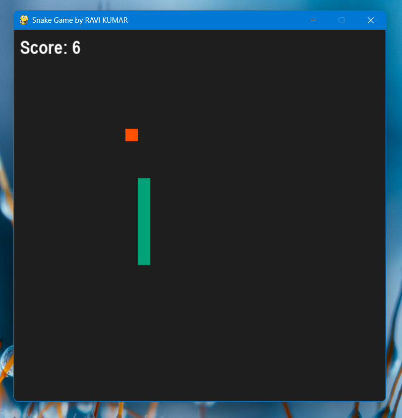

# Snake Game 🐍

A classic Snake Game implemented in Python using **Pygame**, designed by **Me**. Control the snake, eat food, grow longer, and try to beat your high score!

---

## Objective
The objective of the game is to control a snake on a grid and eat food items to grow in length. The game ends if the snake collides with itself.

---

## Setup
The game screen is a square grid with dimensions of 600x600 pixels.  
The snake starts in the center of the grid, facing a default direction (typically right).  
Food items appear randomly on the grid for the snake to eat.

---

## Gameplay Mechanics
- **Snake Movement:** The snake moves continuously in the direction it was last directed by the player using the arrow keys. Arrow keys (UP, DOWN, LEFT, RIGHT) control movement. The snake wraps around the screen edges, appearing on the opposite side if it moves off one edge.  
- **Eating Food:** Food items appear as small rectangles on the grid. When the snake’s head collides with a food item, it consumes it and grows longer by adding a new segment to its tail.  
- **Growing and Scoring:** Each time the snake eats food, the score increases. The game speed may increase as the snake grows.  
- **Game Over Conditions:** The game ends if the snake collides with itself.

---

## Installation

**Requirements:**  
- Python 3.x  
- Pygame library  

**Install Pygame using:** `pip install pygame`

---

## **Steps to Run the Game:** 
- **Clone the repository**: git clone https://github.com/ravi-kumar-chinta/Snake-Game.git
- **Navigate to the folder:** `cd Snake-Game` [Ensure all files (background.mp3, eat.wav, gameover.wav) are in the same folder].
- **Run the game:** python `Snake Game.py`

## Controls 
- Arrow Keys → Move the snake
- R → Restart the game after Game Over
- Q → Quit the game

## Screenshot

Here’s how the game looks:

 
---

**Enjoy Playing!**  
Thank you for checking out **Snake Game**. Have fun growing your snake, beating your high score, and exploring future improvements! 🚀🐍

